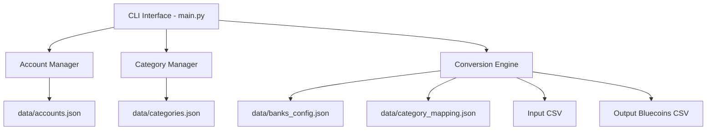

# Architecture

> Auto-generated by /map on 2026-02-14

## Overview

A Financial CLI Toolkit designed to process bank transaction data from CSV files and convert them into a standardized format for Bluecoins. The system manages accounts, categories, and transaction mappings locally using JSON files.

## Components

### CLI (main.py)
- **Purpose:** Entry point and controller for all system features.
- **Location:** `main.py`
- **Responsibilities:** Argument parsing, command routing, and high-level logic.

### Data Storage (data/)
- **Purpose:** Persistent storage for configuration and historical mappings.
- **Location:** `data/*.json`
- **Files:**
  - `accounts.json`: List of financial institutions.
  - `banks_config.json`: Column mappings and date formats for different banks.
  - `categories.json`: Hierarchical category templates (e.g., Bluecoins).
  - `category_mapping.json`: Learned mappings from transaction descriptions to categories.

## Data Flow

1. **Initialization:** CLI parses arguments and ensures `data/` directory exists.
2. **Configuration:** Users manage accounts and categories via `account` and `category` subcommands.
3. **Conversion:** 
   - User provides bank name and input CSV.
   - `main.py` loads `banks_config.json` to identify columns.
   - For each transaction, it looks up `category_mapping.json`.
   - If missing, it prompts user for manual input (interactive).
   - Results are written to the specified output CSV.

## Technical Debt

- [ ] **Monolithic Structure:** `main.py` contains all logic. Should be refactored into modular components (`parser.py`, `converter.py`, `config_manager.py`) as suggested in the original design.
- [ ] **Incomplete ML Feature:** `spec.md` mentions ML categorization, but it's not implemented in the current codebase.
- [ ] **Missing Tests:** No automated test suite exists for unit or integration testing.
- [ ] **Interactive Prompt in Loop:** During conversion, the tool prompts for input if a mapping is missing, which can be disruptive for large files.
