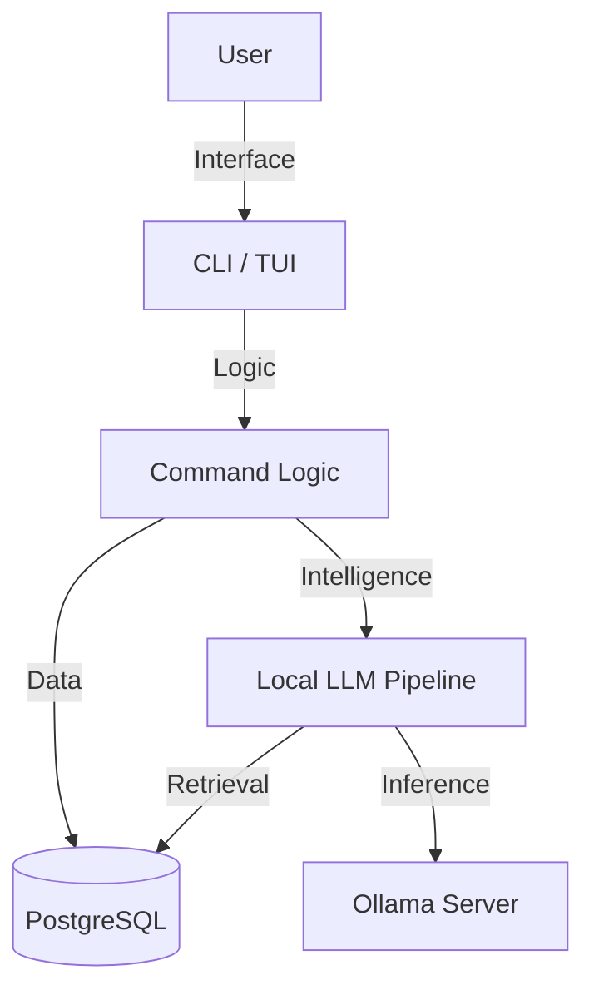

# Architecture

> Auto-generated by /map on 2026-02-15

## Overview

Bluecoins Manager is a local-first personal finance CLI and TUI application designed to manage and categorize transactions with the help of a local Large Language Model (LLM). It emphasizes privacy and "learning" from user feedback to improve categorization accuracy over time using Retrieval Augmented Generation (RAG).

## Components

### CLI / TUI Layer
- **Entry Point:** `main.py`
- **Location:** `src/interactive.py`, `src/tui.py`, `src/commands.py`
- **Purpose:** Handles user arguments, rendering the text-based interface, and orchestrating high-level flows (import, review, reporting).

### Data Layer
- **Location:** `src/database.py`
- **Tech:** SQLAlchemy (Async), PostgreSQL (AsyncPG)
- **Purpose:** 
    - Stores core financial data (`Account`, `Category`, `Transaction`)
    - Stores AI context (`AIMemory`, `LLMKnowledgeChunk`, `LLMSkill`)
    - Manages persistence and migrations

### AI & Logic Layer
- **Location:** `src/local_llm.py`, `src/policy.py`
- **Purpose:**
    - `LocalLLMPipeline`: Connects to Ollama for embedding and chat. Implements RAG logic (retrieve similar past transactions -> prompt LLM).
    - `policy.py`: Defines rules for auto-approving transaction categories based on confidence scores.

## Data Flow

1. **Ingestion**: Raw bank CSVs are parsed and normalized into `Transaction` records.
2. **Analysis**: 
    - New transactions are embedded (vectorized).
    - RAG retrieval finds similar past transactions.
    - LLM proposes a Category and Confidence Score.
3. **Review**: 
    - Transactions are placed in a Queue (`needs_review`, `auto_approved`).
    - User interacts via TUI to confirm or correct categories.
4. **Learning**:
    - Verified transactions are re-indexed as `LLMFineTuneExample` and `LLMKnowledgeChunk` to improve future predictions.

## Integration Points

| Service | Type | Purpose |
|---------|------|---------|
| Ollama | API (Local) | Embedding generation (`nomic-embed-text`) and Chat (`llama3.1`) |
| PostgreSQL | Database | Persistent storage for relational data and vector embeddings (as JSON/Text) |

## Conventions

- **Async First**: Core DB and Logic paths are asynchronous (`asyncio`).
- **Type Hints**: Extensive use of Python type hinting.
- **Environment**: Configuration via `.env` (`DATABASE_URL`, `OLLAMA_HOST`).
